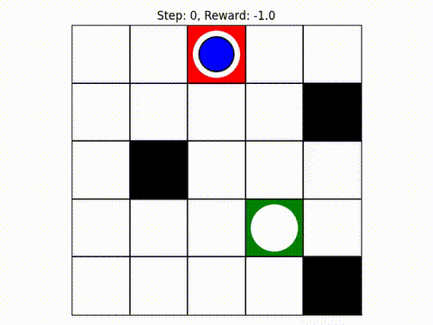

# Proximal Policy Optimization

<p style="font-size: 18px;">For this project, I implemented the well-known Proximal Policy Optimization (PPO) algorithm using PyTorch. I applied it to solve a simple reinforcement learning task in a custom grid environment, where the agent learns to reach a target position as quickly as possible while avoiding a moving obstacle.

## PPO Agent Overview

<p style="font-size: 18px;">This implementation applies the Proximal Policy Optimization (PPO) algorithm using PyTorch to a custom grid-based reinforcement learning environment. The agent is trained to reach a target position as quickly as possible while avoiding moving obstacles within a 5x5 grid.

---

## The PPO class

<p style="font-size: 18px;"> The `PPO` class encapsulates the entire training and policy update logic for the agent. Here's a resume of his components:

### `__init__()`
- <p style="font-size: 18px;">Initializes the environment (`GridEnv`) with a <strong>nrow</strong>x<strong>ncols</strong> grid and <strong>nobs</strong> dynamic obstacles.
- <p style="font-size: 18px;">Sets key hyperparameters: learning rate, discount factor (`gamma`), GAE parameter (`lam`), clipping factor(`eps_clip`), batch size, number of epochs, and optional KL-divergence threshold.
- <p style="font-size: 18px;">Instantiates the Actor-Critic model and optimizer.
- <p style="font-size: 18px;">Creates a separate frozen policy (`policy_old`) used to collect actions without being updated during training.
- <p style="font-size: 18px;">Initializes a `ReplayBuffer` to store agent experiences during training.

``` python 
    def __init__(self, env_name, lr, gamma, lam, minibatch_size, num_epochs, eps_clip, target_KL = None):
        self.env = gym.make(env_name, num_obstacles = 3, nrow = 5, ncol= 5)
        self.state_dim  = self.env.observation_space.shape[0]
        self.action_dim = self.env.action_space.n
        self.lr = lr
        self.gamma = gamma
        self.lam = lam
        self.eps_clip = eps_clip
        self.num_epochs = num_epochs
        self.batch_size = minibatch_size
        self.target_KL = target_KL
        self.memory = ReplayBuffer()
        self.policy = ActorCritic(self.state_dim, self.action_dim).to(device)
        self.optimizer = torch.optim.Adam(self.policy.parameters(), lr = self.lr, eps=1e-5)
        self.policy_old = ActorCritic(self.state_dim, self.action_dim).to(device)
        self.policy_old.load_state_dict(self.policy.state_dict())
        self.Loss = nn.MSELoss()
        self.reward_history = []
```

### `select_action(state)`
<p style="font-size: 18px;"> -Selects an action from the current state using the old policy (`policy_old`) to ensure stability during training.
<p style="font-size: 18px;"> -Stores the current state, chosen action, log-probability, and estimated state value in memory.

```python
    def select_action(self, state):
        with torch.no_grad():
            state = torch.FloatTensor(state).to(device)
            action, logprob, state_val = self.policy_old.act(state)
        self.memory.states.append(state)
        self.memory.actions.append(action)
        self.memory.logprobs.append(logprob)
        self.memory.state_values.append(state_val)
        return action.item()
```

### `compute_gae(...)`
- <p style="font-size: 18px;">Computes <strong>Generalized Advantage Estimation (GAE)</strong> to reduce variance in policy gradient updates.
- <p style="font-size: 18px;">Uses a backward pass through the collected rewards and values to compute the advantage estimates for each step.

```python
    def compute_gae(self, rewards, values, dones, next_state):
        
        with torch.no_grad():
            advantages = []
            gae = 0
            
            for t in reversed(range(len(rewards))):
                if t == len(rewards)-1:
                    next_value = self.policy.critic(next_state)
                else:
                    next_value = values[t+1]
                
                #dones[t] IS REFERRING TO TERMINAL CONDITION OF THE NEXT STATE = values[t+1]
                mask = 1-dones[t]
                delta = rewards[t] + self.gamma * mask * next_value  - values[t]
                gae = delta + self.gamma * self.lam * mask * gae
                advantages.insert(0, gae)

        return torch.tensor(advantages, dtype=torch.float32)

```

### `update_gae(next_state_gae)`
- <p style="font-size: 18px;">Performs multiple epochs of mini-batch updates to optimize both the actor and critic networks.
- <p style="font-size: 18px;">Applies PPO-specific <strong>clipped surrogate objective</strong> to prevent large policy updates.
- <p style="font-size: 18px;">Computes:
    <p style="font-size: 18px;"> - Surrogate loss for the policy
    <p style="font-size: 18px;"> - Value loss for the critic
- <p style="font-size: 18px;"> Adds Entropy bonus to encourage exploration
- <p style="font-size: 18px;"> Optional: uses early stopping if KL divergence exceeds a target threshold.
- <p style="font-size: 18px;"> Updates `policy_old` to reflect the current policy after optimization.

```python
    def update_gae(self, next_state_gae):
        rewards      = torch.tensor(self.memory.rewards, dtype=torch.float32).to(device)
        dones        = torch.tensor(self.memory.is_terminals, dtype=torch.float32).to(device)
        old_states   = torch.stack(self.memory.states).to(device).detach()
        old_actions  = torch.stack(self.memory.actions).to(device).detach()
        old_logprobs = torch.stack(self.memory.logprobs).to(device).detach()
        values       = torch.tensor(self.memory.state_values, dtype=torch.float32).to(device)
        advantages = self.compute_gae(rewards, values, dones, next_state_gae)
        returns = advantages + values
        clipfracs = []
        
        for _ in range(self.num_epochs):    
            indices = np.arange(len(old_states))
            np.random.shuffle(indices)
            for i in range(0, len(indices), self.batch_size):

                batch_indices = indices[i: i + self.batch_size]
                states_batch = old_states[batch_indices]
                actions_batch = old_actions[batch_indices]
                logprobs_batch = old_logprobs[batch_indices]
                advantages_batch = advantages[batch_indices]
                advantages_batch = (advantages_batch - advantages_batch.mean()) / (advantages_batch.std() + 1e-8)


                logprobs, state_values, dist_entropy = self.policy.evaluate(states_batch, actions_batch)
                ratios = torch.exp(logprobs - logprobs_batch) #.detach()
                
                with torch.no_grad():
                    approx_kl = ((ratios - 1) - logprobs + logprobs_batch).mean()
                    clipfracs += [((ratios - 1.0).abs() > self.eps_clip).float().mean().item()]

                surrogate_obj = ratios * advantages_batch
                clipped_surrogate_obj = torch.clamp(ratios, 1 - self.eps_clip, 1 + self.eps_clip) * advantages_batch

                critic_loss = 0.5 * self.Loss(state_values.squeeze(), returns[batch_indices]) #rewards
                loss = -torch.min(surrogate_obj, clipped_surrogate_obj).mean() + critic_loss - 0.01 * dist_entropy.mean()

                self.optimizer.zero_grad()
                loss.backward()
                nn.utils.clip_grad_norm_(self.policy.parameters(), 0.5)
                self.optimizer.step()

            if self.target_KL is not None:
                if approx_kl > self.target_KL:
                    print('KULBACK LEIBLER GREATER THAN TARGET')
                    break
            

        self.policy_old.load_state_dict(self.policy.state_dict())
        self.memory.clear()
```

### `train(train_steps, update_timestep)`
- <p style="font-size: 18px;">Runs the main training loop:
  <p style="font-size: 18px;"> - Collects experiences from the environment.
  <p style="font-size: 18px;"> - Updates the policy every `update_timestep` steps.
  <p style="font-size: 18px;"> - Tracks episodic rewards and prints progress.
  <p style="font-size: 18px;"> - Applies <strong>linear learning rate annealing</strong> over time.
  <p style="font-size: 18px;"> - Resets the environment when an episode ends.
  <p style="font-size: 18px;"> - Saves the model checkpoint at the end of training.

```python
    def train(self, train_step, update_timestep):
        
        timesteps = 0
        num_updates = 0
        results_dir = "Autonomous_Projects/Results"
        os.makedirs(results_dir, exist_ok=True)
        state = self.env.reset(options = options)[0]
        episode_reward = 0
        episode = 0
        total_updates = train_step/update_timestep
        for _ in range(train_step):
            
            action = self.select_action(state)
            next_state, reward, done, _, _ = self.env.step(action)
            self.memory.rewards.append(reward)
            self.memory.is_terminals.append(done)
            episode_reward += reward
            state = next_state
            timesteps += 1
            
            if timesteps % update_timestep == 0:
                    ###HERE UPDATE THE LERNING RATE USING LR ANNEALING
                    next_gae_state = torch.tensor(state, dtype= torch.float32)
                    num_updates += 1
                    frac = 1 - (num_updates-1)/total_updates
                    new_lr = self.lr*frac
                    new_lr = max(new_lr, 0)
                    self.optimizer.param_groups[0]["lr"] = new_lr
                    self.update_gae(next_gae_state)

            ##IF DONE THE EPISODE IS TERMINATED AND SO UPDATE THE STATS
            if done:
                
                episode += 1
                self.reward_history.append(episode_reward)
                print(f"Episode {episode}, Reward: {episode_reward}")
                episode_reward = 0
                #If episode terminates reset the environment
                state = self.env.reset(options = options)[0]

        #At the end of training iterations save the model parameters
        self.save("Autonomous_Projects/maze.pth")
```


### `save(...)` / `load(...)`
- <p style="font-size: 18px;">Utility functions to save and load model parameters from disk.

```python
    def save(self, checkpoint_path):
        torch.save(self.policy_old.state_dict(), checkpoint_path)

    def load(self, checkpoint_path):
        self.policy_old.load_state_dict(torch.load(checkpoint_path, map_location=device, weights_only = True))
        self.policy.load_state_dict(torch.load(checkpoint_path, map_location=device, weights_only = True))
```

---

## `ActorCritic` Network

<p style="font-size: 18px;">The PPO agent is built on an <strong>Actor-Critic architecture</strong>, implemented using PyTorch.


<p style="font-size: 18px;">The network consists of two separate components:

<p style="font-size: 18px;"> - Actor: Responsible for selecting actions based on the current state.
<p style="font-size: 18px;"> - Critic: Estimates the value function (i.e., expected future rewards from a given state).

<p style="font-size: 18px;">Both components share the same input (the state), but are implemented as separate neural networks.

```python
class ActorCritic(nn.Module):
    def __init__(self, state_dim, action_dim):
        super(ActorCritic, self).__init__()
        
        self.actor = nn.Sequential(
            nn.Linear(state_dim, 64), 
            nn.Tanh(),
            nn.Linear(64, 64),
            nn.Tanh(),
            nn.Linear(64, action_dim), 
            nn.Softmax(dim=-1)
        )

        self.critic = nn.Sequential(
            nn.Linear(state_dim, 64),
            nn.Tanh(),
            nn.Linear(64, 64),
            nn.Tanh(),
            nn.Linear(64, 1)
        )
```
